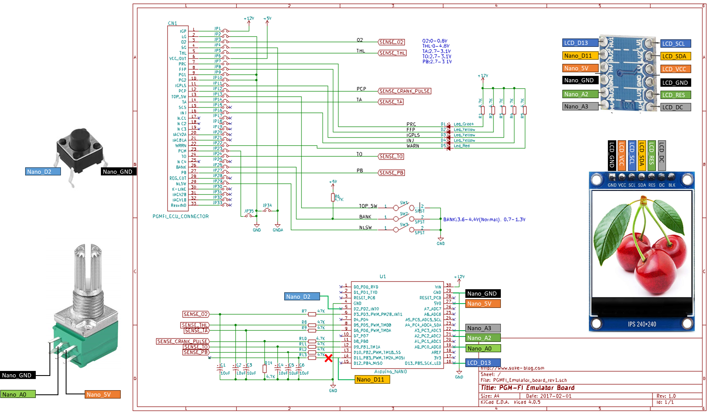

# PGM-FI_Emulator_LittleCab

https://www.suke-blog.com/cub_ecu_emulator/ を外部からボリュームで回転数を変更、USBシリアルとSPI接続のLCDに表示できるよう手を加えました。  

使用部品は下記の通りです。  
* ボリューム: [uxcell 炭素被膜ポテンショメータ 可変抵抗器 ダブルロータリー RV097NS 100KΩ 5個入り](https://www.amazon.co.jp/dp/B07TFT9ZJK/)  
* ボタン: [LAXIR 押しボタンスイッチ タクトスイッチ セット 10種類](https://www.amazon.co.jp/dp/B0B2WNJC3D/)  
* LCD: [DiyStudio 1.3" カラーIPS LCDディスプレイ240X240](https://www.amazon.co.jp/dp/B07SZC2PSP/)  
* 5V-3.3Vレベル変換: [VKLSVAN 6個 セット 双方向ロジックレベル変換モジュール 4チャンネル 3V～5V IIC I2C ロジックレベル変換器](https://www.amazon.co.jp/dp/B086WWCJGQ/)  
* 
なお、回転数調整用のボリューム・LCDを追加した回路図は以下の通りです。
  

※波形出力に影響しないようD2ピンがLOWの場合に割り込みをかけて回転数を変更し、クランクパルスの時間を変更するようにしています。